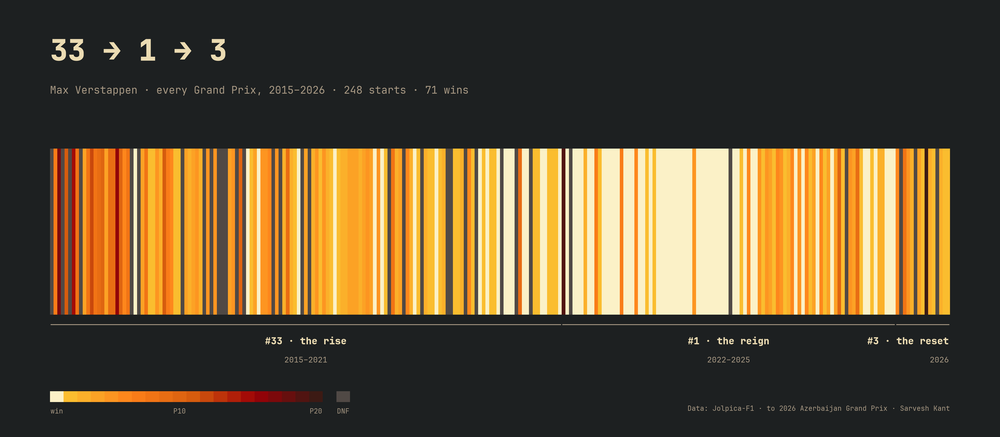
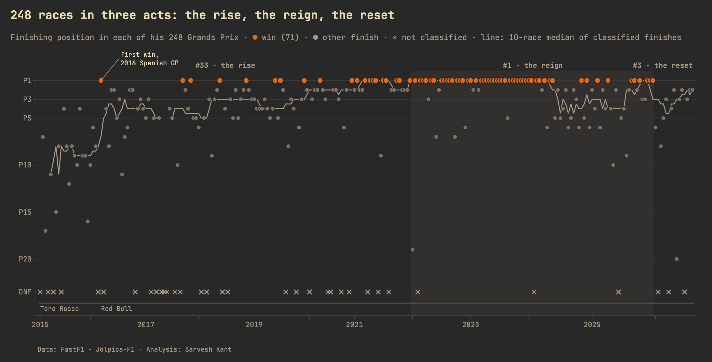
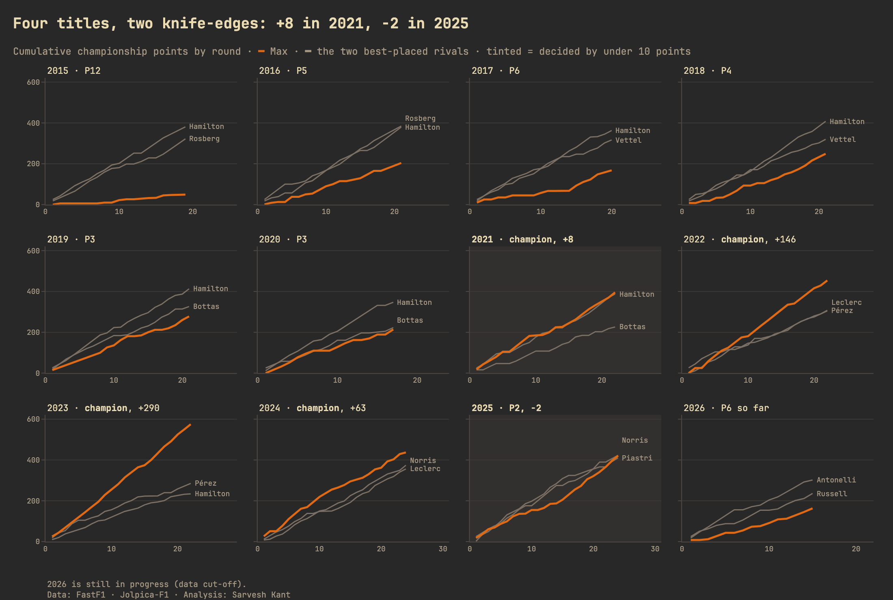
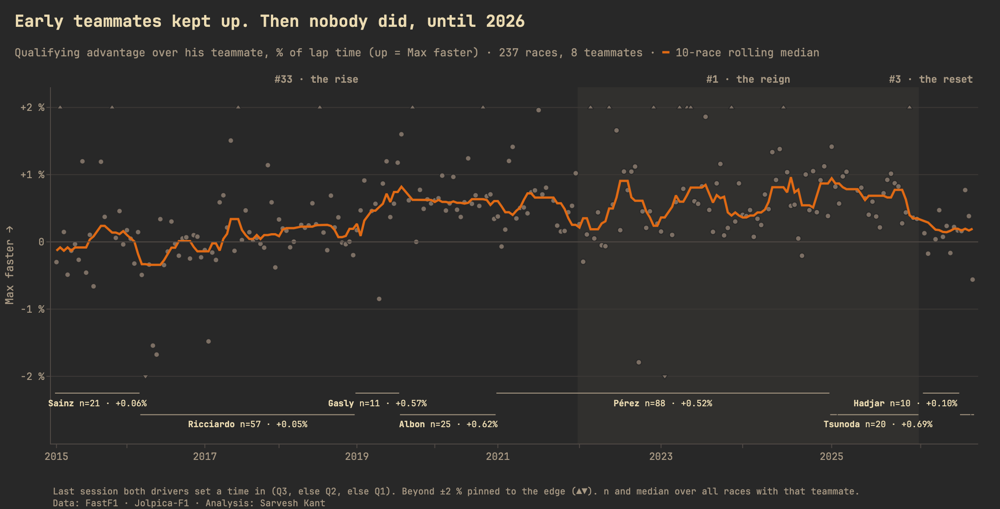
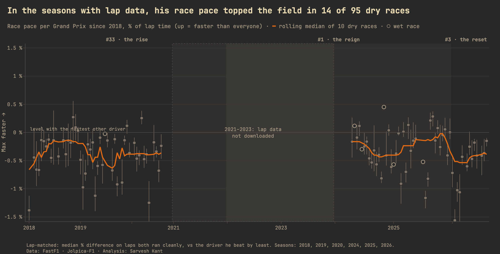
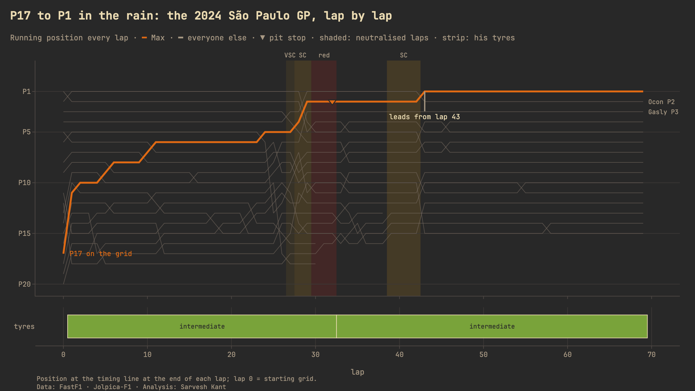
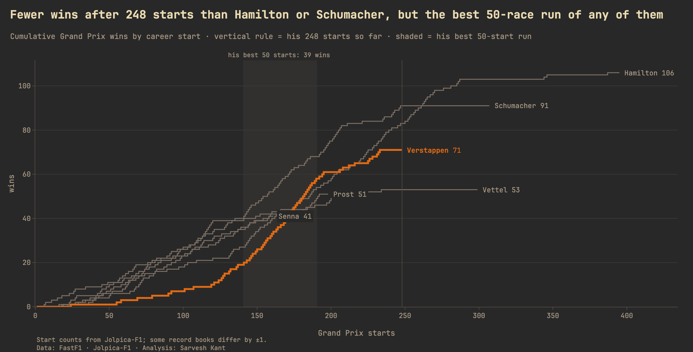

# 33 → 1 → 3 — Max Verstappen's Formula 1 Career in Data



A visualization-first data story about one Formula 1 career, told through his three car numbers:
**#33** (the rise), **#1** (the reign) and **#3** (the 2026 reset). Every chart title states a finding the data
supports; where the data contradicts a popular narrative, the chart says so.

**→ Read the interactive case study:** https://sarveshkantonline.com/projects/verstappen-in-data.html

This is a descriptive, editorial project: prose and charts read top to bottom, not a dashboard and not a model.
(For forward-looking machine learning on F1, see my separate **F1 Race Predictor**.)

## Key findings

- **248 Grands Prix, 71 wins, 4 titles** (2021, 2022, 2023, 2024).
- **Two titles were decided by under 10 points:** **2021** (won by 8 points) and **2025** (lost by 2 points).
- **Early teammates kept up; later ones didn't.** Median qualifying advantage over Sainz (+0.06 %), Ricciardo (+0.05 %); over every teammate from 2019 to 2025: 0.52–0.69 %. In 2026, over Hadjar: +0.10 % (n=10).
- **Among the greats:** after 248 starts he has 71 wins; Michael Schumacher had 91, Lewis Hamilton had 83 at the same point. But his best 50-start run had **39 wins**, more than any of them.
- **2026 so far:** 0 wins, 7 podiums in 15 races, P6 in the championship.

## Gallery

| | |
|---|---|
| **Every race**<br> | **Every title race**<br> |
| **The teammate gap**<br> | **The dominance index**<br> |
| **Anatomy of a signature race**<br> | **Among the greats**<br> |

All charts are interactive on the case-study page (hover for every value) and come in the site's dark and light themes.

## Methodology (summary)

- **Data:** [Jolpica-F1](https://github.com/jolpica/jolpica-f1) (the Ergast-compatible API) for results, qualifying and
  standings, 2015 → today; [FastF1](https://github.com/theOehrly/Fast-F1) for
  lap-by-lap timing and telemetry, which **exists only from 2018**.
- **Validated:** starts, wins, podiums, titles and career points reproduce the official record exactly; rebuilt
  standings match every official driver-season (`notebooks/01_data_audit.ipynb`).
- **Races = Grands Prix only;** sprints are stored separately and never counted as wins.
- **"Fastest qualifier"** is used instead of "pole", because pole counts differ between record-keepers (grid
  penalties, 2021 sprint rules) — see the audit for the reconciliation.
- **Qualifying gaps** use the last session both drivers set a time in, as % of the faster lap.
- **Race pace** compares laps both drivers ran cleanly on the same lap numbers (lap 1, pit laps and safety-car laps
  excluded), with bootstrap confidence intervals; wet races are shown separately.
- The checks behind every number are in `notebooks/01_data_audit.ipynb`; the reasoning behind the charts is in `notebooks/02_eda.ipynb`.

**Data cut-off:** 2026 Azerbaijan Grand Prix (round 15, 2026-09-26). The season is live; `make refresh`
re-pulls data after each race and rebuilds every chart and this README.

## Reproduce

```bash
make setup     # Python 3.12 venv + pinned dependencies
make data      # fetch (cached) Jolpica data → data/processed/*.parquet
python -m src.laps   # FastF1 laps 2018+ (first run takes hours: FastF1 limits itself to 500 calls/hour)
make test      # stat-rule unit tests
make charts    # every chart → output/web (JSON) + output/static (PNG)
make refresh   # after a new race
```

## Structure

```
src/        download · results · laps · stats · features · theme · charts/cXX_*.py · poster · build_charts
scripts/    export_to_site.py · build_readme.py · swatches.py
notebooks/  01_data_audit · 02_eda
data/       reference/ (hand-curated, sourced) · processed/ (parquet) · cache/ (gitignored)
output/     facts.json (every number in the prose) · web/ · static/
```

## Attribution and disclaimer

Data from Jolpica-F1 and FastF1 (F1 live-timing). This is an unofficial project, not associated in any way with the
Formula 1 companies. F1, FORMULA ONE and related marks are trademarks of Formula One Licensing B.V. No logos or
photos are used.

## Author

Sarvesh Kant · [sarveshkantonline.com](https://sarveshkantonline.com) · [GitHub](https://github.com/sarveshkant2003-afk)

Code: MIT License.
